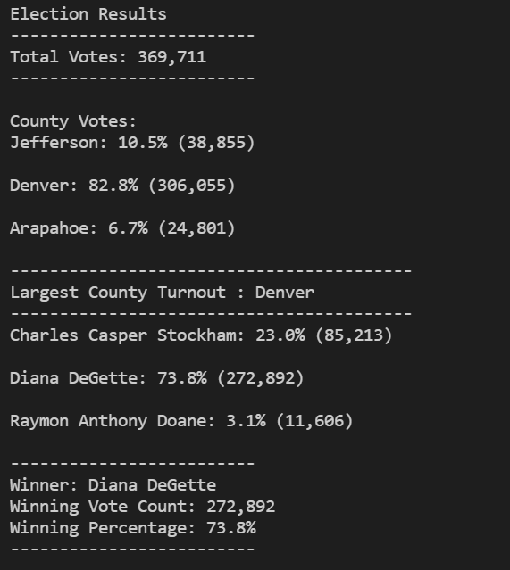

# Election_Analysis

## Overview of Project

### Purpose
The purpose of this election audit analysis is :
1. To find out how each county performed based on the percentage of voter turnout
2. To find the performance of each candidate based on the number of votes they reieved. 

## Results

### Election Audit Results
- How many votes were cast in this congressional election?
  369,711 were casted in the congressional election.
- Provide a breakdown of the number of votes and the percentage of total votes 
  for each county in the precinct.
  1. More than 80% of the votes were casted for Denver county followed by Jefferson and Arapahoe.
     
	 - Denver : 82.8% : 306,055
	 - Jefferson : 10.5% : 38,855
	 - Arapahoe : 6.7% : 24,801
	 
- Which county had the largest number of votes?
  Denver has the largest number of votes(306,055)
  
- Provide a breakdown of the number of votes and the percentage of the
  total votes each candidate received.
  1. 
  
- Which candidate won the election, what was their vote count, and what was 
  their percentage of the total votes?
  
  

  

## Summary
  
	 
